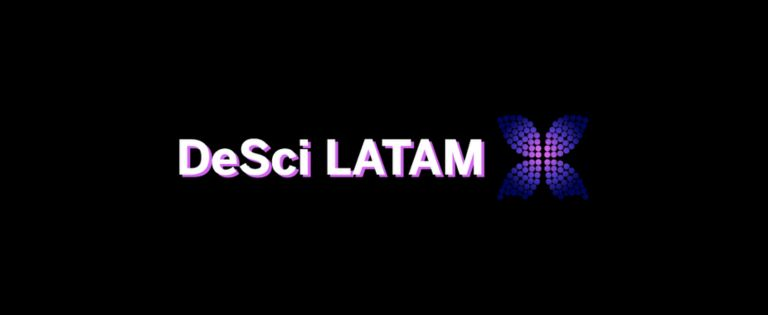

## ¡Hola Mundo! 🌎

#### Septiembre 2021

### Primeros Pasos 🚶‍♂️

Creemos en la transparencia, la comunicación abierta y la colaboración con nuestra comunidad. Por eso, hemos decidido implementar un changelog, una herramienta que nos permite mantener a nuestra comunidad informada sobre los cambios, mejoras y logros que estamos haciendo.

- Creamos nuestra primera versión de imagen de marca.
- Creamos nuestro Twitter, ahora X, <a href="https://x.com/descilatam" target="_blank">x.com/descilatam</a>.
- Creamos un Notion, que luego fue reemplazado por nuestra web.
- Creamos nuestro servidor en Discord.
- Participamos de nuestra primera Ronda en Gitcoin.