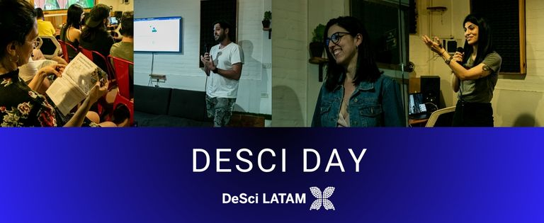
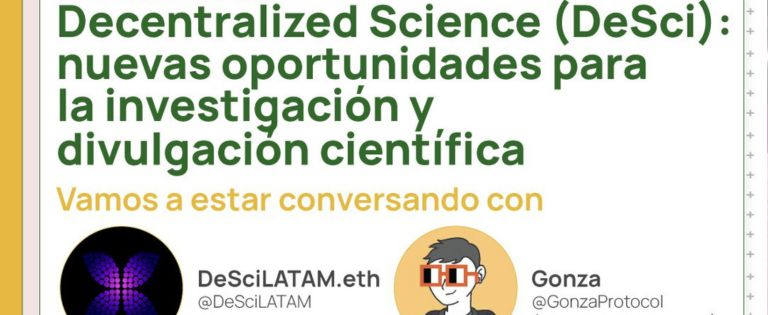

## ¡Primer Evento DeSci en LATAM! 🚀

#### Diciembre 2022

### DeSci DAY en Argentina

El 15 de diciembre de 2022, realizamos el primer evento DeSci en Argentina, llamado DeSci DAY, con la participación de @DeSciWorld, @IberoAm, @GainForestNow y @CryptoReuMD (Bankless). Al evento asistieron más de 30 invitados, y agradecemos a Gitcoin, Quadratic Funding y a nuestros usuarios por hacer posible este evento. 

<blockquote class="twitter-tweet" data-theme="dark">
El primer <a href="https://twitter.com/hashtag/DeSciDAY?src=hash&amp;ref_src=twsrc%5Etfw">#DeSciDAY</a> en Buenos Aires por <a href="https://twitter.com/hashtag/DeSciLATAM?src=hash&amp;ref_src=twsrc%5Etfw">#DeSciLATAM</a> 🧵🧬  Les dejamos un pequeño recap de la primera meetup de muchas más 📸  Pronto se vienen las charlas completas 😉 <a href="https://t.co/rVPxNWwUDW">pic.twitter.com/rVPxNWwUDW</a>
&mdash; DeSci LATAM 🦋 (@DeSciLATAM) <a href="https://twitter.com/DeSciLATAM/status/1623015025693626397?ref_src=twsrc%5Etfw">February 7, 2023</a></blockquote> 

Puedes ver todas las charlas de DeSci DAY en nuestro canal de YouTube.

<a href="https://www.youtube.com/@descilatam" target="_blank">¡No te pierdas ninguna!</a>

#### Noviembre 2022

- Participamos en un Twitter Space de Gitcoin, interactuando con la comunidad sobre temas de descentralización e innovación.
- Estuvimos en un Space organizado por AprendoLATAM. Puedes verlo <a href="https://twitter.com/APRENDOlatam/status/1593625054981623810" target="_blank">aquí</a>.

