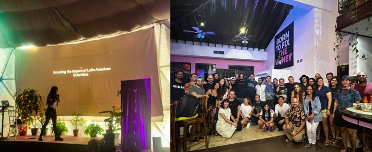

#### Abril 2024
- Mushroom Protocol Twitter Space
<iframe width="100%" height="315" src="https://x.com/DeSciLATAM/status/1777812244786545133" title="YouTube video player" frameborder="0" allow="accelerometer; autoplay; clipboard-write; encrypted-media; gyroscope; picture-in-picture; web-share" referrerpolicy="strict-origin-when-cross-origin" allowfullscreen></iframe>
- DeSci y ReSci en el Caribe Mexicano: Explorando Proyectos en Blockchain
<iframe width="100%" height="315" src="https://www.youtube.com/embed/EqPW5CfUjf4?si=_bV3_moJxkTiUPq9" title="YouTube video player" frameborder="0" allow="accelerometer; autoplay; clipboard-write; encrypted-media; gyroscope; picture-in-picture; web-share" referrerpolicy="strict-origin-when-cross-origin" allowfullscreen></iframe>

- Gitcoin Round Grant

<iframe width="100%" height="315" src="https://explorer.gitcoin.co/#/round/42161/39/30" title="YouTube video player" frameborder="0" allow="accelerometer; autoplay; clipboard-write; encrypted-media; gyroscope; picture-in-picture; web-share" referrerpolicy="strict-origin-when-cross-origin" allowfullscreen></iframe>
- Hicimos nuestro primer space en portugués
<iframe width="100%" height="315" src="https://x.com/Descilatampt/status/1781292070851822011" title="YouTube video player" frameborder="0" allow="accelerometer; autoplay; clipboard-write; encrypted-media; gyroscope; picture-in-picture; web-share" referrerpolicy="strict-origin-when-cross-origin" allowfullscreen></iframe>

#### Marzo 2024
-	Livestream donde hablamos de Privacidad en medicina y divulgamos DeSci Rio con Roberto de IberoAm
https://www.youtube.com/watch?v=ajIFakKtB7w&t=2s

- DeSci LATAM in Vitalia - Honduras
- Twitter Space con DeSci MX: https://twitter.com/DeSciMX/status/1766099130676302227

- College Talk : 
https://twitter.com/DeSciLATAM/status/1771296140308181409

<iframe width="100%" height="315" src="https://www.youtube.com/embed/D6Jg9r5EWXc?si=s8R0CumuffRLWGMT" title="YouTube video player" frameborder="0" allow="accelerometer; autoplay; clipboard-write; encrypted-media; gyroscope; picture-in-picture; web-share" referrerpolicy="strict-origin-when-cross-origin" allowfullscreen></iframe>

- Se suman a Colaborar Laura y Fabian al equipo.

- Rodrigo de MeSoReefDAO realiza una conferencia en DeSci Summit en Denver y realiza una mencion a nuestro trabajo.

#### Febrero 2024

- Livestream de proyecto de investigación sobre envejecimiento de las neuronas 

<iframe width="100%" height="315" src="https://www.youtube.com/embed/c_2WQB_c3hI?si=SQvOEmMArVyWrGYp" title="YouTube video player" frameborder="0" allow="accelerometer; autoplay; clipboard-write; encrypted-media; gyroscope; picture-in-picture; web-share" referrerpolicy="strict-origin-when-cross-origin" allowfullscreen></iframe>
